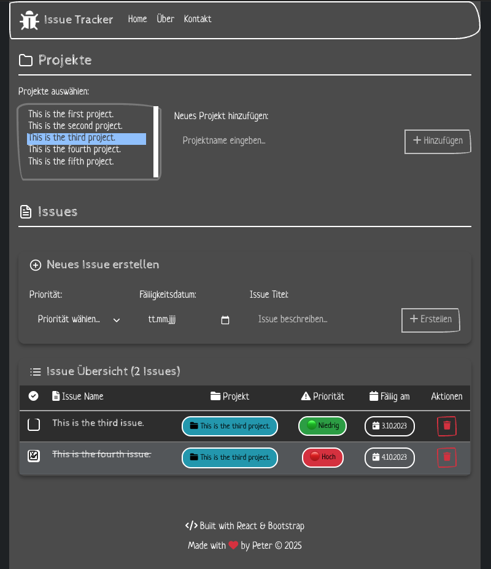

# React + TypeScript + Vite Issue Tracker

This is a React-based Issue Tracker application built with TypeScript, Vite, and Bootstrap. It allows you to manage projects and their associated issues with a clean, dark-themed interface.

## Features

- **Project Management**: Create and manage multiple projects
- **Issue Tracking**: Create, edit, and track issues with priorities and due dates
- **1:n Relationship**: Each project can have multiple issues
- **Dark Theme**: Modern dark UI with Bootstrap
- **Responsive Design**: Works on desktop and mobile devices

## Tech Stack

- **React 18** with TypeScript
- **Vite** for fast development and building
- **Bootstrap 5** for styling
- **Font Awesome** for icons

## Getting Started

### Prerequisites

- Node.js (version 16 or higher)
- npm or yarn package manager

### Installation

1. Clone the repository:
```bash
git clone <your-repo-url>
cd reactjs-todoapp
```

2. Install dependencies:
```bash
npm install
```

### Development Server

Start the development server:
```bash
npm run dev
```

The application will be available at `http://localhost:5173`

### Linting

Run ESLint to check for code issues:
```bash
npm run lint
```

### Building for Production

Build the application for production:
```bash
npm run build
```

Preview the production build:
```bash
npm run preview
```

## JSON Server Setup (Optional)

For persistent data storage during development, you can use json-server:

### Install JSON Server

```bash
# Install globally
npm install -g json-server

# Or install as dev dependency
npm install --save-dev json-server
```

### Create Database File

Create a `db.json` file in the root directory:

```json
{
  "Project": [
    {
      "id": "22c054b7-4078-4d02-9034-e4b186bcb81f",
      "name": "Sample Project"
    }
  ],
  "Issue": [
    {
      "id": "fa48263b-a110-4f25-a774-2fcf03f35d78",
      "title": "Sample Issue",
      "priority": "2",
      "dueDate": "2025-12-31",
      "done": false,
      "projectId": "22c054b7-4078-4d02-9034-e4b186bcb81f"
    }
  ]
}
```

### Run JSON Server

```bash
# If installed globally
json-server --watch db.json --port 3001

# If installed as dev dependency
npx json-server --watch db.json --port 3001
```

The JSON server will be available at `http://localhost:3001`

### API Endpoints

- `GET/POST /Project` - Manage projects
- `GET/POST /Issue` - Manage issues
- `GET /Project/:id` - Get specific project
- `GET /Issue/:id` - Get specific issue
- `PUT/PATCH /Issue/:id` - Update issue
- `DELETE /Issue/:id` - Delete issue
- `PATCH /Project/:id` - Update project (e.g., mark as inactive)

**Note**: The application automatically handles the mapping between the internal data structure and the JSON server schema.

Currently, two official plugins are available:

- [@vitejs/plugin-react](https://github.com/vitejs/vite-plugin-react/blob/main/packages/plugin-react) uses [Babel](https://babeljs.io/) for Fast Refresh
- [@vitejs/plugin-react-swc](https://github.com/vitejs/vite-plugin-react/blob/main/packages/plugin-react-swc) uses [SWC](https://swc.rs/) for Fast Refresh

## Expanding the ESLint configuration

If you are developing a production application, we recommend updating the configuration to enable type-aware lint rules:

```js
export default tseslint.config([
  globalIgnores(['dist']),
  {
    files: ['**/*.{ts,tsx}'],
    extends: [
      // Other configs...

      // Remove tseslint.configs.recommended and replace with this
      ...tseslint.configs.recommendedTypeChecked,
      // Alternatively, use this for stricter rules
      ...tseslint.configs.strictTypeChecked,
      // Optionally, add this for stylistic rules
      ...tseslint.configs.stylisticTypeChecked,

      // Other configs...
    ],
    languageOptions: {
      parserOptions: {
        project: ['./tsconfig.node.json', './tsconfig.app.json'],
        tsconfigRootDir: import.meta.dirname,
      },
      // other options...
    },
  },
])
```

You can also install [eslint-plugin-react-x](https://github.com/Rel1cx/eslint-react/tree/main/packages/plugins/eslint-plugin-react-x) and [eslint-plugin-react-dom](https://github.com/Rel1cx/eslint-react/tree/main/packages/plugins/eslint-plugin-react-dom) for React-specific lint rules:

```js
// eslint.config.js
import reactX from 'eslint-plugin-react-x'
import reactDom from 'eslint-plugin-react-dom'

export default tseslint.config([
  globalIgnores(['dist']),
  {
    files: ['**/*.{ts,tsx}'],
    extends: [
      // Other configs...
      // Enable lint rules for React
      reactX.configs['recommended-typescript'],
      // Enable lint rules for React DOM
      reactDom.configs.recommended,
    ],
    languageOptions: {
      parserOptions: {
        project: ['./tsconfig.node.json', './tsconfig.app.json'],
        tsconfigRootDir: import.meta.dirname,
      },
      // other options...
    },
  },
])
```

# Demo Screenshot


