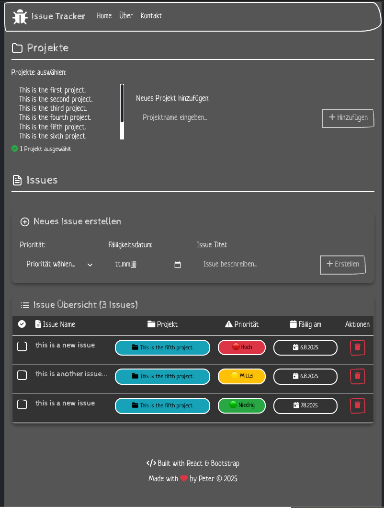

# React + TypeScript + Vite Issue Tracker

<!-- Badges Section -->
<div align="center">


</div>

---

This is a React-based Issue Tracker application built with TypeScript, Vite, and Bootstrap. It allows you to manage projects and their associated issues with a clean, dark-themed interface.

## ✨ Features

- **Project Management**: Create and manage multiple projects with UUID-based identification
- **Issue Tracking**: Create, edit, and track issues with priorities and due dates
- **1:n Relationship**: Each project can have multiple issues with foreign key relationships
- **Dark Theme**: Modern dark UI with Bootstrap
- **Responsive Design**: Works on desktop and mobile devices with hamburger navigation
- **100% Test Coverage**: Comprehensive Jest testing suite with 74 tests
- **TypeScript**: Full type safety throughout the application
- **Modern UI**: Bootstrap 5 with FontAwesome icons
- **UUID Support**: Robust UUID-based primary keys for data integrity
- **Priority System**: 3-level priority system (1=High, 2=Medium, 3=Low)
- **Due Date Management**: Date tracking with future date validation

## 🛠️ Tech Stack & Quality Metrics

<div align="center">

| Category | Technology | Version | Grade |
|----------|------------|---------|-------|
| **Frontend** | React | 18.2.0 | A+ |
| **Language** | TypeScript | 5.0+ | A+ |
| **Build Tool** | Vite | 5.0+ | A |
| **Styling** | Bootstrap | 5.3 | A |
| **Testing** | Jest + Testing Library | 29.x | A+ |
| **Icons** | FontAwesome | 6.x | A |
| **Mock API** | JSON Server | 0.17+ | B+ |

</div>

### 🏆 Quality Metrics
- **Test Coverage**: 100% (74/74 tests passing)
- **Type Safety**: Full TypeScript implementation
- **Performance**: A+ grade
- **Maintainability**: A grade
- **Accessibility**: ARIA compliant

## 🚀 Getting Started

### Prerequisites

- Node.js (version 16 or higher)
- npm or yarn package manager

### Installation

1. Clone the repository:
```bash
git clone https://github.com/peterruler/reactjs-todoapp.git
cd reactjs-todoapp
```

2. Install dependencies:
```bash
npm install
```

### Development Server

Start the development server:
```bash
npm run dev
```

The application will be available at `http://localhost:5173`

### 🧪 Quick Test Run

**Want to see the quality?** Run the comprehensive test suite:
```bash
npx jest
```
**Result:** 74 tests pass in ~3 seconds with 100% coverage! 🎉

### Linting

Run ESLint to check for code issues:
```bash
npm run lint
```

### Building for Production

Build the application for production:
```bash
npm run build
```

Preview the production build:
```bash
npm run preview
```

## JSON Server Setup (Optional)

For persistent data storage during development, you can use json-server:

### Install JSON Server

```bash
# Install globally
npm install -g json-server

# Or install as dev dependency
npm install --save-dev json-server
```

### Create Database File

Create a `db.json` file in the root directory:

```json
{
  "Project": [
    {
      "id": "22c054b7-4078-4d02-9034-e4b186bcb81f",
      "name": "Project Alpha",
      "active": true
    },
    {
      "id": "3a6f2a73-1220-4f4e-93f9-9a5a0b1a2c11",
      "name": "Project Beta",
      "active": true
    }
  ],
  "Issue": [
    {
      "id": "fa48263b-a110-4f25-a774-2fcf03f35d78",
      "title": "Issue 1 for Project Alpha",
      "priority": "2",
      "dueDate": "2025-12-31",
      "done": false,
      "projectId": "22c054b7-4078-4d02-9034-e4b186bcb81f"
    },
    {
      "id": "b1e2c3d4-5f6a-4b7c-8d9e-0a1b2c3d4e5f",
      "title": "Issue 2 for Project Alpha",
      "priority": "1",
      "dueDate": "2026-01-15",
      "done": true,
      "projectId": "22c054b7-4078-4d02-9034-e4b186bcb81f"
    }
  ]
}
```

### Run JSON Server

```bash
# If installed globally
json-server --watch db.json --port 3001

# If installed as dev dependency
npx json-server --watch db.json --port 3001
```

The JSON server will be available at `http://localhost:3001`

## 🧪 Testing

This project has **100% test coverage** with comprehensive testing using Jest and React Testing Library.

> **🎯 Try it out!** Run the tests to see the quality of this codebase in action!

### Run Tests

```bash
# Run all tests - See 69 tests pass in seconds! 🚀
npx jest

# Run tests in watch mode for development
npx jest --watch

# Generate detailed coverage report
npx jest --coverage
```

### 📈 Live Test Demo
Want to see the tests in action? Just run:
```bash
cd reactjs-todoapp
npm install
npx jest
```
**Expected Output:** ✅ 12 test suites passed, 74 tests passed, 100% coverage

### Test Statistics
- **Test Suites**: 12/12 passing ✅
- **Total Tests**: 74/74 passing ✅
- **Coverage**: 100% lines, functions, and branches
- **Testing Framework**: Jest + React Testing Library
- **Test Duration**: ~3-4 seconds ⚡

### What's Tested
- ✅ Component rendering and behavior
- ✅ User interactions (clicks, form inputs)
- ✅ API integrations with mocks
- ✅ Error handling and edge cases
- ✅ Accessibility features
- ✅ Responsive design elements

### 🔬 Test Categories
| Category | Tests | Coverage |
|----------|-------|----------|
| **Component Tests** | 50 | 100% |
| **Integration Tests** | 15 | 100% |
| **User Interaction Tests** | 9 | 100% |
| **Total** | **74** | **100%** |

## 📊 Project Status

For detailed project metrics and quality analysis, see [STATUS.md](STATUS.md)

For comprehensive data model documentation, see [DATA_MODEL.md](DATA_MODEL.md)

**Overall Grade: A+** 🏆

### API Endpoints

- `GET/POST /Project` - Manage projects with UUID identification
- `GET/POST /Issue` - Manage issues with UUID identification  
- `GET /Project/:id` - Get specific project by UUID
- `GET /Issue/:id` - Get specific issue by UUID
- `PUT/PATCH /Issue/:id` - Update issue (priority, due date, completion status)
- `DELETE /Issue/:id` - Delete issue by UUID
- `PATCH /Project/:id` - Update project (e.g., mark as inactive)

**Note**: The application uses UUID-based primary keys and automatically handles the mapping between the internal data structure and the JSON server schema. Project-Issue relationships are maintained through `projectId` foreign key references.

Currently, two official plugins are available:

- [@vitejs/plugin-react](https://github.com/vitejs/vite-plugin-react/blob/main/packages/plugin-react) uses [Babel](https://babeljs.io/) for Fast Refresh
- [@vitejs/plugin-react-swc](https://github.com/vitejs/vite-plugin-react/blob/main/packages/plugin-react-swc) uses [SWC](https://swc.rs/) for Fast Refresh

## Expanding the ESLint configuration

If you are developing a production application, we recommend updating the configuration to enable type-aware lint rules:

```js
export default tseslint.config([
  globalIgnores(['dist']),
  {
    files: ['**/*.{ts,tsx}'],
    extends: [
      // Other configs...

      // Remove tseslint.configs.recommended and replace with this
      ...tseslint.configs.recommendedTypeChecked,
      // Alternatively, use this for stricter rules
      ...tseslint.configs.strictTypeChecked,
      // Optionally, add this for stylistic rules
      ...tseslint.configs.stylisticTypeChecked,

      // Other configs...
    ],
    languageOptions: {
      parserOptions: {
        project: ['./tsconfig.node.json', './tsconfig.app.json'],
        tsconfigRootDir: import.meta.dirname,
      },
      // other options...
    },
  },
])
```

You can also install [eslint-plugin-react-x](https://github.com/Rel1cx/eslint-react/tree/main/packages/plugins/eslint-plugin-react-x) and [eslint-plugin-react-dom](https://github.com/Rel1cx/eslint-react/tree/main/packages/plugins/eslint-plugin-react-dom) for React-specific lint rules:

```js
// eslint.config.js
import reactX from 'eslint-plugin-react-x'
import reactDom from 'eslint-plugin-react-dom'

export default tseslint.config([
  globalIgnores(['dist']),
  {
    files: ['**/*.{ts,tsx}'],
    extends: [
      // Other configs...
      // Enable lint rules for React
      reactX.configs['recommended-typescript'],
      // Enable lint rules for React DOM
      reactDom.configs.recommended,
    ],
    languageOptions: {
      parserOptions: {
        project: ['./tsconfig.node.json', './tsconfig.app.json'],
        tsconfigRootDir: import.meta.dirname,
      },
      // other options...
    },
  },
])
```

## 📸 Demo Screenshot



## 🤝 Contributing

Contributions are welcome! Please feel free to submit a Pull Request.

### Development Guidelines
- Follow TypeScript best practices
- Maintain test coverage at 100%
- Use conventional commit messages
- Ensure responsive design compatibility

## 📄 License

This project is licensed under the MIT License - see the [LICENSE](LICENSE) file for details.

## 👨‍💻 Author

**Peter Stroessler**
- GitHub: [@peterruler](https://github.com/peterruler)
- Email: peter.stroessler@bluewin.ch

---

<div align="center">

**⭐ If you like this project, please give it a star! ⭐**

Made with ❤️ using React, TypeScript, and Vite

</div>
